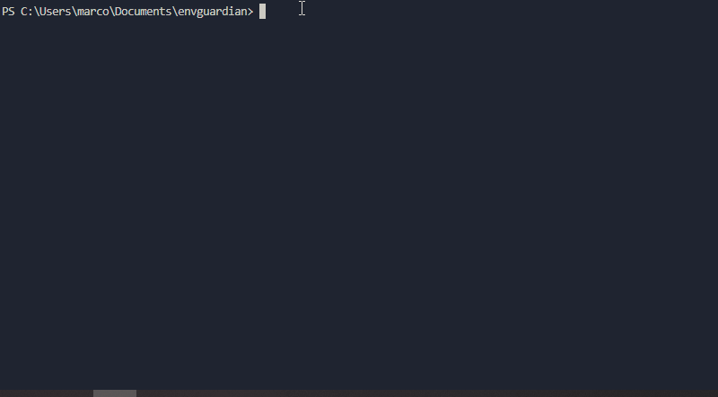

<p align="center">
  
  
</p>

<p align="center">
  <strong>Catch missing and inconsistent environment variables before deploy.</strong>
</p>

<p align="center">
  <a href="https://github.com/marcusjgb/envguardian/actions/workflows/envguardian.yml">
    
  </a>
  
  
  
  
</p>

> ⚠️ Prevent broken deployments caused by missing environment variables.

---

# 🚀 Demo

EnvGuardian scans your project and detects missing environment variables before deployment.



Example:

```bash
npx @marcosjgb/envguardian check --cwd tests/fixtures/sample-project
````

---

# 🧠 What is EnvGuardian?

EnvGuardian scans your codebase, detects environment variables used in your project, and compares them with your `.env` files.

It helps you identify:

* missing variables
* unused variables
* inconsistencies between `.env` and `.env.example`

👉 The goal is simple: **catch env issues before they break your app**.

---

# ✨ Features

* Detect environment variables used in code
* Compare `.env` and `.env.example`
* Identify missing variables
* Detect unused variables
* CI-ready (`--ci` support)
* Stack agnostic
* Zero config required

---

# ⚡ Quick Start

Run without installing:

```bash
npx @marcosjgb/envguardian check
```

---

# 📦 Installation

Global install:

```bash
npm install -g @marcosjgb/envguardian
```

Then:

```bash
envguardian check
```

---

# 🧪 CLI Usage

```bash
envguardian check
envguardian check --only-missing
envguardian check --ci
envguardian check --ci --only-missing
envguardian sync
```

---

# 🔍 Example Output

```text
EnvGuardian
Scanning project: .

✖ Missing variables detected

Missing in .env
  - DATABASE_URL
  - JWT_SECRET

✖ EnvGuardian check failed
```

---

# 🔧 CI Integration

EnvGuardian can run in CI pipelines and fail builds when variables are missing.

## Example: GitHub Actions

```yaml
name: EnvGuardian Check

on:
  pull_request:
  push:
    branches: [ main ]

jobs:
  envguardian:
    runs-on: ubuntu-latest

    steps:
      - uses: actions/checkout@v4

      - uses: actions/setup-node@v4
        with:
          node-version: 20

      - name: Create .env for CI
        run: |
          cat > .env <<EOF
          DATABASE_URL=dummy_database_url
          JWT_SECRET=dummy_jwt_secret
          VITE_API_URL=http://localhost:3000
          EOF

      - name: Run EnvGuardian
        run: npx @marcosjgb/envguardian check --ci --only-missing
```

👉 If variables are missing, the pipeline fails.

---

# 🌍 Supported Patterns

EnvGuardian detects environment variables in multiple ecosystems.

### Node.js

```js
process.env.VARIABLE_NAME
process.env["VARIABLE_NAME"]
```

### Vite / Frontend

```js
import.meta.env.VARIABLE_NAME
```

### Python

```python
os.getenv("VARIABLE_NAME")
```

### Ruby

```ruby
ENV["VARIABLE_NAME"]
```

---

# 🧠 Example Use Case

You deploy your app.

Everything works locally…

💥 Production crashes because a variable is missing.

EnvGuardian catches it before deploy:

```bash
envguardian check
```

---

# 📁 Project Structure

```text
envguardian/
├─ assets/
├─ src/
│  ├─ cli/
│  ├─ commands/
│  ├─ core/
│  ├─ config/
│  └─ utils/
├─ tests/
├─ README.md
├─ CONTRIBUTING.md
├─ CODE_OF_CONDUCT.md
└─ ROADMAP.md
```

---

# 🛣️ Roadmap

See [ROADMAP.md](./ROADMAP.md)

---

# 🤝 Contributing

Contributions are welcome.
Please read [CONTRIBUTING.md](./CONTRIBUTING.md)

---

# 📜 License

MIT


